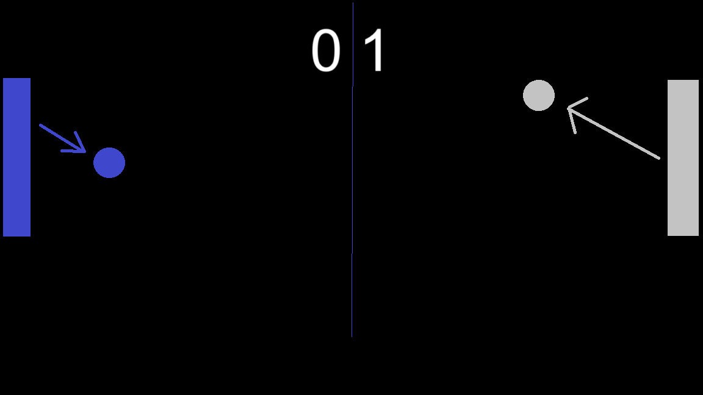

# Pong

This portfolio project is my attempt at recreating the game Pong with `BSL with list abbreviations` (a student programming language based on Racket).

Learn more about the game [here](https://en.wikipedia.org/wiki/Pong) and [here](https://www.ponggame.org/).

## Description of Implementation

My version of Pong accomodates only one user, which controls the in-game paddle on the left side of the screen. Whoever, the user or the computer, reaches 11 points first wins the game.

The differences between this implementation and the classic Pong are:

-   The win condition is changed from 11 points to 9 points.
-   The user cannot use physics to alter the speed and direction of the ball. Programming-wise, the in-game physics of my implementation does not take into account elastic/inelastic collisions.

## Domain Analysis

## Constant Definitions

DIVIDER

-   DVDR-COLOR
-   DVDR-WIDTH
-   DVDR-STYLE
-   DVDR-CAP
-   DVDR-JOIN

BACKGROUND

-   BG-WIDTH
-   BG-HEIGHT
-   BG-COLOR

PADDLE-WIDTH
PADDLE-HEIGHT

USER-COLOR\
ENEMY-COLOR\
USER-PADDLE\
ENEMY-PADDLE

USER-LINE\
ENEMY-LINE

BALL-SIZE\
BALL-COLOR\
BALL

SCORE-SIZE\
SCORE-COLOR\
SCORE-XP\
SCORE-YP

## Game Elements

### `y-position`

The position of a particle along the y-axis on screen, ranging from integers 0 to BG-HEIGHT.

### `x-direction`

A `x-direction` is the direction of movement along the x-axis, which is one of 2 cases:

-   1
-   -1

Interpretation. 1 means right-wards movement, -1 means left-wards movement.

### `y-direction`

A `y-direction` is the direction of movement along the y-axis, which is one of 2 cases:

-   -1
-   1

Interpretation. -1 means upwards movement, 1 means downwards movement.

### `ball`

The `ball` is the ball each player hits with their `paddle`.

1. `xdir` is the ball's horizontal direction of movement, and
2. `ydir` is the ball's vertical direction of movement.

### `score`

A `score` is a `paddle`'s score in a game of Pong, ranging from integers 0 to 9.

### `paddle`

A `paddle` is a player in a game of Pong, which contains the following attributes:

1. `ypos` - the player's current y-position,
1. `ydir` - the player's `direction` of movement, and
1. `score` - the player's current `score`.

### `game`

The `game` is the program's entire state, containing:

1.  `user` - the `paddle` the user (you) controls,
2.  `enemy` - the `paddle` the computer controls, and
3.  `ball` - the `ball` each `paddle` is trying to hit.

## `big-bang` options

-   `on-tick`
-   `to-draw`
-   `on-key`
-   `stop-when`

## Helper Functions

### `on-tick`

This function will take care of the ball's movement, the enemy paddle's movement, and the paddles' scores.

#### `handle-user`

This function will handle the user's movement and score.

#### `handle-enemy`

This function will handle the enemy's movement and score.

#### `handle-ball`

The function will handle the ball's movement.

### `to-draw`

This helper function renders all the game elements on screen.

#### `render-ball`

#### `render-paddles`

### `on-key`

This helper function handles the user's key inputs and help the user control the user paddle.

### `stop-when`

This helper function keeps track of the two paddles' scores in every game's state. It should display an end-game message, indicating whether the user or the enemy won the game.
